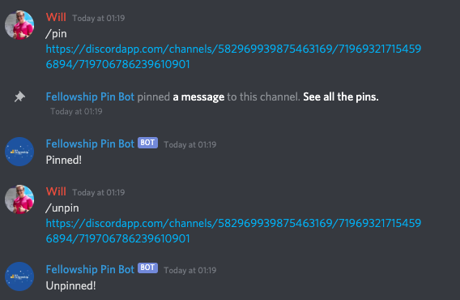

# MLH Fellowship Pin Bot

Discord bot to allow Fellows to pin messages!

## Setup

Replace `"MY_TOKEN"` with the token generated in the Discord Developer Portal.

```
virtualenv .venv
source .venv/bin/activate
pip install -r requirements.txt
cat TOKEN="MY_TOKEN" > .env
```

## Run

```
python -m bot
```

## Usage

### Pin message

```
/pin {url}
```

### Unpin message

```
/unpin {url}
```

